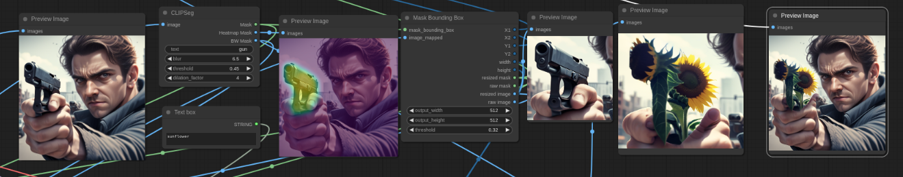

# ComfyUI - Mask Bounding Box

## Overview
The ComfyUI Mask Bounding Box Plugin provides functionalities for selecting a specific size mask from an image. Can be combined with ClipSEG to replace any aspect of an SDXL image with an SD1.5 output.

## Features

- **Thresholding**: Threshold by mask value
- **Raw/resized Mask**: Selects the largest bounded mask.
- **Raw/resized Image**: Applies the selected image to the bounded mask.
- **Keeps aspect ratio**: Aspect ratio is fixed by your specified output size.

## Usage

* Add the 'Mask Bounding Box' plugin
* Attach a mask and image
* Output the resulting bounding box and resized mask/images.

Great for inpainting or selecting certain objects.

## Feedback & Contributions

If you have feedback or would like to contribute to the development of this plugin, please submit a pull request.

